<!-- canidelete: ignore-file -->
<div align="center">

# 🗑️ canidelete

**Your codebase is full of workarounds whose reason to exist died years ago.<br>canidelete finds them.**

[](https://github.com/Telle-dev/canidelete/actions/workflows/ci.yml)


[](#badge)
[](#-support)



</div>

```python
# Workaround for https://github.com/acme/http/issues/6432
# REMOVE-WHEN: requests>=2.32
session.mount("https://", LegacyCertAdapter())
```

You wrote that eighteen months ago. The upstream bug got fixed. You upgraded `requests`.
The workaround is still there, and nobody remembers why.

```console
$ pipx run canidelete

✅ DELETE IT  src/client.py:2
     ✅ requests>=2.32  you have requests 2.32.3 (requirements.txt)
✅ DELETE IT  src/compat.ts:41
     ✅ https://github.com/acme/compiler/issues/4792  closed 7mo ago "Support satisfies"
✅ DELETE IT  src/legacy.py:12
     ✅ 2026-06-30  deadline passed 87 days ago
🪦 WON'T FIX  src/ios.css:88
     🪦 https://github.com/acme/browser/pull/1234  PR closed without merging 2y 1mo ago

14 tripwires in 9 files: 3 delete it, 1 won't fix, 10 not yet
🗑️  3 workarounds can be deleted today.
```

## Why this is different

TODO scanners tell you **how old** a comment is. That tells you nothing. A 3-year-old workaround
for a bug that's still open is doing its job. A 2-week-old one for a bug fixed yesterday is dead code.

canidelete checks **whether the reason still exists**:

| Tripwire | Fires when |
|---|---|
| `REMOVE-WHEN: https://github.com/o/r/issues/123` | the issue is closed as completed |
| `REMOVE-WHEN: https://github.com/o/r/pull/45` | the PR is **merged** (not just closed) |
| `REMOVE-WHEN: requests>=2.32` | your locked/installed version satisfies it |
| `REMOVE-WHEN: npm:react>=19` / `pypi:django>=5` | same, with an explicit ecosystem |
| `REMOVE-WHEN: python>=3.12` / `node>=22` | your runtime is new enough |
| `REMOVE-AFTER: 2026-12-31` | the date has passed |
| any bare GitHub issue/PR link in a comment | the linked issue closes: **works with zero setup on existing code** |

It also tells you when to give up waiting: issues closed as **not planned** and PRs **closed without
merging** show up as 🪦 *won't fix*, so you can make the workaround permanent and stop pretending.

Combine conditions and they must **all** hold:

```js
// REMOVE-WHEN: npm:react>=19, node>=22
```

Any comment syntax works (`#`, `//`, `/* */`, `<!-- -->`, `--`, …). `REMOVE-WHEN`, `REMOVE_WHEN`,
`DELETE-WHEN`, `DROP-WHEN`, `REMOVE-AFTER` and `canidelete:` are all recognized.
Add `canidelete: ignore` to a line to silence it, or `canidelete: ignore-file` anywhere in a file (handy for test fixtures).

## Install

```bash
pipx run canidelete          # try it, no install
pipx install canidelete      # or: pip install canidelete
```

Or just download a single file. It is one self-contained script with **zero dependencies**:

```bash
curl -O https://raw.githubusercontent.com/Telle-dev/canidelete/main/canidelete/cli.py
python cli.py
```

## Usage

```bash
canidelete                  # scan the current git repo
canidelete src/ lib/        # scan specific paths
canidelete --all            # also show tripwires that haven't fired yet
canidelete --check          # exit 1 if something can be deleted (CI)
canidelete --check --strict # also fail on won't-fix / unknown
canidelete --markers-only   # ignore bare links, only explicit REMOVE-WHEN markers
canidelete --format json    # or: markdown
canidelete --offline        # no network; dates and versions only
```

GitHub's API allows 60 unauthenticated requests/hour. canidelete deduplicates issues and fetches them
in parallel, but for bigger repos set `GITHUB_TOKEN` (or be logged in with `gh`, which is picked up automatically).

### Where versions come from

| Ecosystem | Sources (in order) |
|---|---|
| npm | `node_modules/*/package.json`, `package-lock.json`, `yarn.lock`, `pnpm-lock.yaml` |
| Python | `uv.lock`, `poetry.lock`, `pdm.lock`, pinned `requirements*.txt`, installed packages |
| Runtimes | `python` = the running interpreter, `node` = `node --version` |

## GitHub Action: a bot that tells you on every PR

Add this file and canidelete comments on pull requests **only when there's something to delete**,
then keeps that one comment up to date. No spam, no noise.

```yaml
# .github/workflows/canidelete.yml
name: canidelete
on:
  pull_request:
  schedule: [{ cron: "0 8 * * 1" }]   # weekly report in the job summary
permissions:
  contents: read
  pull-requests: write
jobs:
  scan:
    runs-on: ubuntu-latest
    steps:
      - uses: actions/checkout@v4
      - uses: Telle-dev/canidelete@v0.1.0
```

What your team sees on the PR ([live example](https://github.com/Telle-dev/canidelete/pull/1)):

> ### 🗑️ 2 workarounds can be deleted
>
> | | Location | Why |
> |---|---|---|
> | ✅ DELETE IT | `src/http/client.py:42` | ✅ `requests>=2.32` you have requests 2.32.3 (requirements.txt) |
> | ✅ DELETE IT | `web/Modal.tsx:17` | ✅ `github.com/acme/ui-kit/issues/2450` closed 1y 2mo ago |

Options: `check: true` fails the job, `comment: false` turns off comments, `badge: badge.svg` writes a badge.

## Badge

Show the world your codebase is clean:

[](https://github.com/Telle-dev/canidelete)

```bash
canidelete --badge badge.svg     # green at 0, orange under 5, red after that
```

Or the static one, if you just want people to know you track workarounds:

```markdown
[](https://github.com/Telle-dev/canidelete)
```

## pre-commit

```yaml
# .pre-commit-config.yaml
repos:
  - repo: https://github.com/Telle-dev/canidelete
    rev: v0.1.0
    hooks:
      - id: canidelete   # offline: versions and dates only, never slows your commit on the network
```

## How it works

1. Lists files with `git ls-files` (respects `.gitignore`), skipping binaries, lockfiles, `node_modules` and docs.
2. Finds tripwire markers and bare GitHub links, line by line.
3. Resolves every unique issue/PR once through the GitHub REST API, 8 at a time.
4. Resolves versions from your lockfiles, never from the network.
5. A finding is **delete it** only if *every* condition on it is met.

It never modifies your code.

## FAQ

**Isn't this just a TODO linter?** No. It doesn't care about TODOs or their age. It checks an external
fact (is the issue closed, is the version installed, has the date passed) that decides whether the code is still needed.

**GitLab / Jira?** Not yet. PRs welcome; the GitHub checker is about 40 lines.

**Monorepos?** Run it per package with `-C packages/foo` so versions resolve against the right lockfile.

## Contributing

```bash
git clone https://github.com/Telle-dev/canidelete && cd canidelete
python -m unittest discover -s tests
```

Issues and PRs are very welcome. If canidelete deleted some dead code for you, a ⭐ helps other people find it.

## 💜 Support

If canidelete saved you some time, you can buy me a coffee in Litecoin:

**LTC:** `LYAhqRNLjzSCfAzFKGLRnRA7qFnfidbT1U`

## License

MIT
